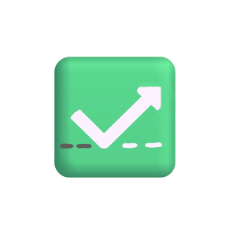

#  NextStep – Alltags- & Zielmanagement App

## **Vision**
NextStep strukturiert den Alltag, fördert Motivation und macht persönliche Ziele leichter erreichbar .  
Die App kombiniert intelligentes Aufgabenmanagement, Wochenplanung, gemeinschaftliche Ziele, Gesundheitserinnerungen und nützliche Formulare in einem modernen, benutzerfreundlichen Design.

---

## **Hauptfunktionen**

### **Frontend**
- **Startseite (Home):**  
  Motivierende Zitate und ein ansprechendes Video-Design sorgen für einen positiven Einstieg in den Tag.  

- **Dashboard:**  
  Übersicht über Erinnerungen, anstehende Aufgaben und Fortschritte – ergänzt durch visuelle Elemente wie Fortschrittsbalken und intuitive Bedienelemente.  

- **Planer:**  
  Monatsansicht mit allen Terminen und Ereignissen. Einfache Bedienung zur Organisation des Alltags.

---

### **Backend**
- Zentrale Verwaltung von Erinnerungen, Aufgaben und Terminen.  
- Automatische Berechnung und Darstellung von Fortschrittsdaten.
- Lokale Verschlüsselte Speicherung beim Nutzer   
- Möglichkeit, neue Aufgaben, Routinen oder Termine hinzuzufügen.  
- Sichere, strukturierte Datenspeicherung mit Fokus auf Datenschutz und Effizienz.

---

## **Erweiterungsideen**
- **Gesundheitserinnerungen:** Vorsorge, Impfungen und Kooperationen mit Krankenkassen.  
- **Formulare & Vorlagen:** Vordefinierte Formulare (z. B. Kaufverträge, Anträge) mit hilfreichen Hinweisen.  
- **Gemeinschaftliche Ziele & Challenges:** Motivation durch Gruppenfunktionen, gemeinsame Vorsätze oder Challenges.  
- **Lokale & verschlüsselte Datenspeicherung:** Maximale Kontrolle über persönliche Informationen.  

Weitere Ideen sind auf unserem Repo Unter der reiter Projekt auf den kanabn Board zu sehen
 [Kanban Board](https://github.com/users/Marvin-Young-Dev/projects/2/views/1?filterQuery=)
---

## **Projekt Teilnehmer**
**Domske S.** – Schwerpunkt Backend
**Marvin Y.** - Schwerpunkt Frontend

## ****
**Subheib M.** - Trainer [Techstarter / Syntax Institut]
**Marcus W.**  - Trainer [Techstarter / Syntax Institut]

****

---

## **Impression**

