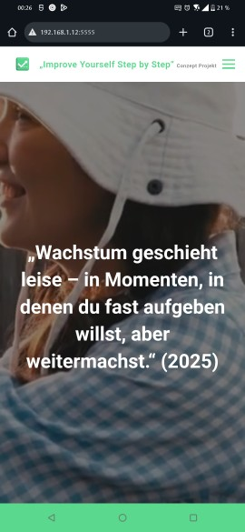

# Alltags- & Zielmanagement App – NextStep

**Vision:**  
NextStep strukturiert den Alltag, fördert Motivation und macht persönliche Ziele leichter erreichbar – **bei maximalem Datenschutz**. Die App kombiniert Aufgabenmanagement, Wochenplanung, gemeinschaftliche Ziele, Gesundheitserinnerungen und Formulare in einem modernen, benutzerfreundlichen Design.

---

## Features (geplante & vorhandene Funktionen)

### MVP – Frontend

#### Home
- [X] Motivierende Worte / Zitate  
- [X] Promo-Video als Hintergrund für ein professionelles Design  

#### Dashboard
- [X] Bereich für Erinnerungen  
- [X] Bereich für anstehende Aufgaben  
- [X] Visueller Fortschrittsbalken  
- [ ] Button zum Hinzufügen neuer Aufgaben oder Routinen  

#### Planer
- [X] Monatsansicht mit Terminen  
- [ ] Button zum Hinzufügen neuer Termine  

---

### MVP – Backend

#### Dashboard
- [ ] Verwaltung von Erinnerungen  
- [ ] Verwaltung anstehender Aufgaben  
- [ ] Berechnung und Darstellung des visuellen Fortschrittsbalkens  
- [ ] Hinzufügen neuer Aufgaben oder Routinen  

#### Planer
- [ ] Monatsübersicht der Termine mit Detailansicht  

---

### Ideen / Erweiterungen
- [ ] **Gesundheitserinnerungen:** Vorsorge, Impfungen; mögliche Kooperationen mit Krankenkassen  
- [ ] **Formulare & Vorlagen:** z. B. Kaufverträge, teilweise vorausgefüllt mit Hinweisen  
- [ ] **Gemeinschaftliche Ziele / Gruppen:** Raucherstopp, Vorsätze, Challenges als Community-Funktion  
- [ ] **Lokale & verschlüsselte Datenspeicherung**  
- [ ] **Darkmode / Theme-Anpassungen**

---

### Vorschläge & Feedback
Wir freuen uns über Ideen, Verbesserungsvorschläge oder Anregungen!  
Schreibt mir bitte eine E-Mail an: **marvin.young.main@gmail.com**  

### Vorschläge & Ideen

- **Nicole N.** - Vorlagen für Anträge
- **Suheib M.** - React Native - (Mobile App erstellung)
